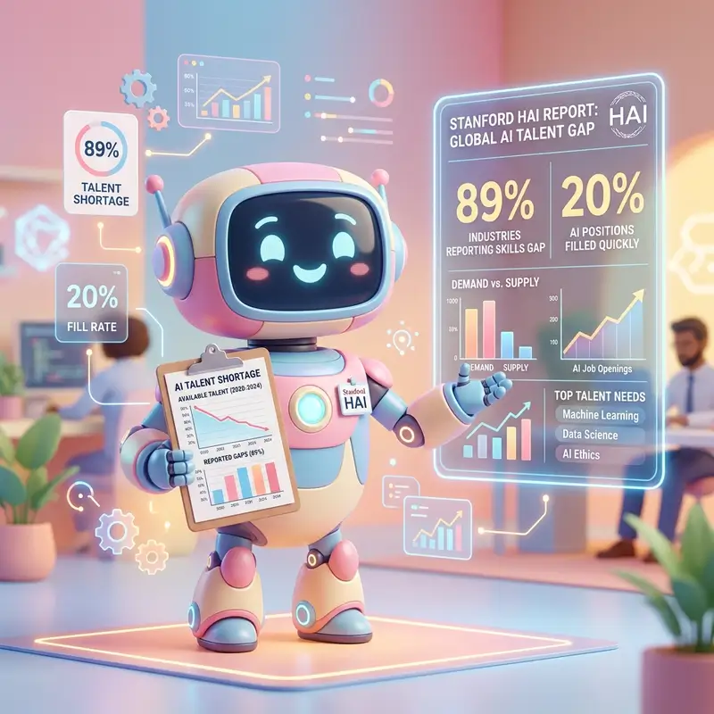

---

스탠포드대학교 인간 중심 AI 연구소(HAI)가 2026년 AI 인덱스 보고서를 공개했습니다. 2017년 이후 미국으로 유입되는 AI 학자 수가 **89% 감소**했고, 22~25세 소프트웨어 개발자 고용은 2024년 이후 **거의 20% 급감**했다는 수치가 핵심입니다. AI 기술의 성능은 그 어느 때보다 빠르게 발전하고 있지만, 정작 이를 관리하고 활용하는 인간 사회의 적응 속도는 그에 미치지 못하고 있다는 경고입니다.

이 보고서는 단순한 통계 모음이 아닙니다. 기술 패권 경쟁, 노동시장 재편, 그리고 AI에 대한 사회적 인식까지 AI 시대의 구조적 변화를 한눈에 조망할 수 있는 연간 지표입니다. 기사 원문 및 주요 뉴스 브리핑은 [AI코리아24 브리핑 2026-04-15](https://aikorea24.kr/briefing/2026-04-15/#item-1)에서 확인하실 수 있습니다.

## 스탠포드 AI 인덱스 2026이 제시한 12가지 핵심 트렌드

스탠포드 HAI는 2017년부터 매년 AI 분야의 기술 역량, 연구 성과, 사회적 영향, 대중 인식 등을 종합 측정한 보고서를 발간합니다. 올해 보고서는 12가지 핵심 트렌드를 제시했으며, 그중 가장 주목되는 항목은 다음과 같습니다.

**미국의 AI 인재 유입이 89% 감소했습니다.** 미국은 여전히 AI 연구자와 개발자가 가장 많은 나라지만, 해외에서 미국으로 이주하는 AI 학자의 수는 2017년 이후 급격히 줄었습니다. 반면 중국은 논문 발표량, 인용 횟수, 특허 출원 건수, 산업용 로봇 설치 건수에서 미국을 앞서고 있습니다.

**모델 성능 격차도 빠르게 좁혀지고 있습니다.** 2026년 3월 기준 LM아레나(사용자 선호도 기반 AI 모델 순위 플랫폼) 최고점은 앤트로픽의 클로드 오퍼스 4.6이지만, 중국 모델이 단 2.7% 차이로 추격 중입니다. 불과 1년 전만 해도 상당한 격차가 있었던 것과 비교하면 의미 있는 변화입니다.

**AI 에이전트(자율적으로 작업을 수행하는 AI) 능력도 급성장했습니다.** 에이전트 능력을 측정하는 터미널벤치(Terminal-Bench) 기준 성공률이 1년 전 20%에서 현재 77.3%로 상승했습니다.

## 89% 감소가 뜻하는 것 미국 AI 매력의 구조적 약화

숫자 하나가 많은 것을 말해줍니다. 2017년 대비 미국으로 향하는 AI 인재가 10명 중 1명 수준으로 줄었다는 것은 단순한 이민 통계가 아닙니다. 이는 미국이 AI 분야 최고 인재들에게 더 이상 압도적인 선택지가 아닐 수 있다는 신호입니다.

이 현상의 원인으로는 여러 요인이 복합적으로 작용하고 있습니다. 중국 AI 기업들의 빠른 성장으로 자국 내 기회가 늘었고, 미국의 이민 정책 변화도 영향을 미쳤습니다. 여기에 중동·유럽 등 각국의 AI 투자 확대로 선택지 자체가 다양해졌습니다. AI 인재를 둘러싼 글로벌 경쟁이 미국 일극 체제에서 다극 체제로 전환되고 있다는 분석이 설득력을 얻습니다.

한국 입장에서도 이 흐름은 기회와 과제를 동시에 의미합니다. AI 강국으로 인정받는 국가의 반열에 드는 것 자체가 우수 인재 유치의 경쟁력이 될 수 있기 때문입니다.

## AI가 신입 개발자 고용을 줄이고 있다는 증거

보고서에서 가장 직접적인 충격을 주는 수치는 **22~25세 소프트웨어 개발자 고용이 2024년 이후 약 20% 급감**했다는 데이터입니다. AI로 인한 생산성 향상이 신규 채용 감소로 이어지고 있다는 첫 번째 구체적 증거라는 점에서 주목됩니다.

고객 서비스 분야에서도 유사한 현상이 관찰됐습니다. AI 노출도가 높은 직군에서 반복적으로 나타나는 패턴입니다. 보고서는 장기적으로 AI로 인한 인력 감축이 계속될 것으로 전망했습니다.

다만 이 수치를 해석할 때 맥락이 중요합니다. 개발자 고용이 줄었다는 것이 곧 개발자가 불필요해진다는 의미는 아닙니다. AI 도구를 능숙하게 활용하는 시니어 개발자의 역할은 오히려 커지는 반면, 반복적 코딩 업무 중심의 신입 포지션이 줄어드는 구조 변화로 이해하는 것이 정확합니다.

## 5817억 달러 투자와 불안의 공존 AI에 대한 엇갈린 시선

보고서는 AI 투자 규모도 기록했습니다. 2025년 전 세계 기업의 AI 투자액은 **5817억 달러(약 800조 원)** 로 전년 대비 130% 증가했습니다. 민간 투자만 따져도 3447억 달러로 전년 대비 127.5% 늘었습니다.

그러나 대중의 인식은 양면적입니다. 글로벌 설문에서 응답자의 59%가 AI의 이점에 낙관적이라고 답했지만, AI 기술에 대한 불안감도 52%를 기록했습니다. 그리고 AI가 자신의 일자리를 위협한다고 답한 비율이 가장 높은 나라는 **미국(67%)** 이었습니다. 전 세계 평균 50%를 크게 웃도는 수치입니다. AI 개발의 중심지에서 오히려 불안감이 가장 크다는 것은 아이러니이자, AI 기업들이 직면한 사회적 과제의 무게를 보여줍니다.

## AI 인덱스 2026이 한국 기업과 개발자에게 시사하는 것

이 보고서가 한국에 던지는 질문은 명확합니다. 첫째, AI 인재를 어떻게 유치하고 유지할 것인가입니다. 인재의 선택지가 다양해진 세계에서 한국이 경쟁력을 갖추려면 단순한 처우 개선을 넘어 연구 환경과 생태계 전반의 매력도를 높여야 합니다.

둘째, 개발자 교육의 방향 전환이 필요합니다. 신입 개발자 고용이 줄어드는 구조 변화 속에서 AI 도구를 활용하는 역량, 즉 'AI와 협업하는 능력'이 커리큘럼의 핵심이 되어야 합니다.

셋째, 기업의 AI 도입 전략이 단기 비용 절감에 머물러서는 안 됩니다. AI로 줄어드는 인력 비용을 어떻게 재투자하여 장기 경쟁력을 만들 것인지에 대한 전략적 고민이 필요합니다.

## AI 기술은 질주하고 있지만 관리 능력은 아직 걸음마 단계입니다

스탠포드 AI 인덱스 2026의 핵심 메시지는 기술의 진보를 부정하는 것이 아닙니다. AI 성능은 박사급 과학 문제와 수학 경시대회에서 인간을 능가하기 시작했고, 에이전트 능력도 빠르게 성숙하고 있습니다. 문제는 이 속도를 우리 사회가 따라가고 있는가입니다.

인재 유입 감소, 신입 고용 축소, 투명성에 대한 우려, 환경 비용 증가. 이 네 가지는 기술의 성능표가 아닌 사회 적응력의 성적표입니다. AI 시대의 경쟁력은 누가 더 빠른 모델을 만드느냐 못지않게, 누가 더 잘 준비된 사회와 인재를 갖추느냐로 결정될 것입니다.

#스탠포드AI인덱스 #AI인재 #AI고용 #개발자취업 #미중AI경쟁 #HAI #AI일자리
